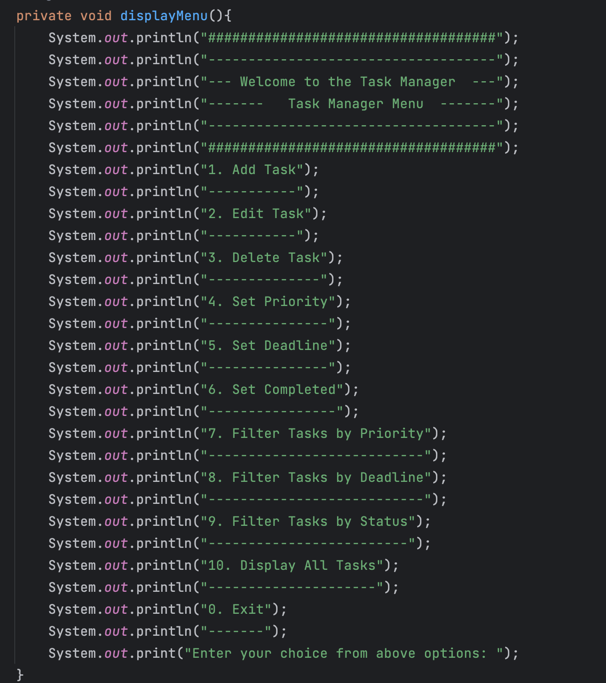
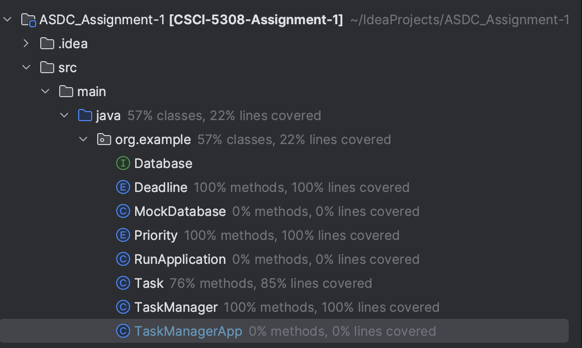

# Assignment 1 – Test-Driven Development
## **Overview** ##

TaskManager application has been created.

The provided code represents a command line Task Manager application implemented in Java

The application provides a menu-based interface with various options such as adding a task, editing a task, deleting a task, setting task priority, setting task deadline, marking a task as completed, filtering tasks by priority, filtering tasks by deadline, filtering tasks by status, and displaying all tasks.

Mocking of database has been done by creating database interface and implementing it to the MockDatabase class

The code consists of three classes: Task, TaskManager, and TaskManagerApp.

The **Task** class represents a task and has properties such as task name, description, manager, creation date, priority, deadline, and completion status. It provides methods to get and set these properties.

The **TaskManager** class is responsible for managing tasks. It has a list of tasks and provides methods to add, delete, edit, and retrieve tasks. It also allows filtering tasks based on priority, deadline, and completion status.

The **TaskManagerApp** class is a command-line application that interacts with the user. It creates an instance of TaskManager and provides a menu-driven interface to perform operations such as adding, editing, deleting, and filtering tasks.

## **Instructions** ##

When the program is run, it will ask for a user input for the following list:

If the valid input is selected, it will ask further points related to that choice. Else it will show the message as "Invalid choice selected"

## **Checklist** ##
- [x] 600 lines of code
- [x] Interaction with the user via command-line
- [x] Pretending to use a database
- [x] Method with business logic covered by tests
- [x] README file included

## **Coverage** ##
Business logic has been is covered in tests:
